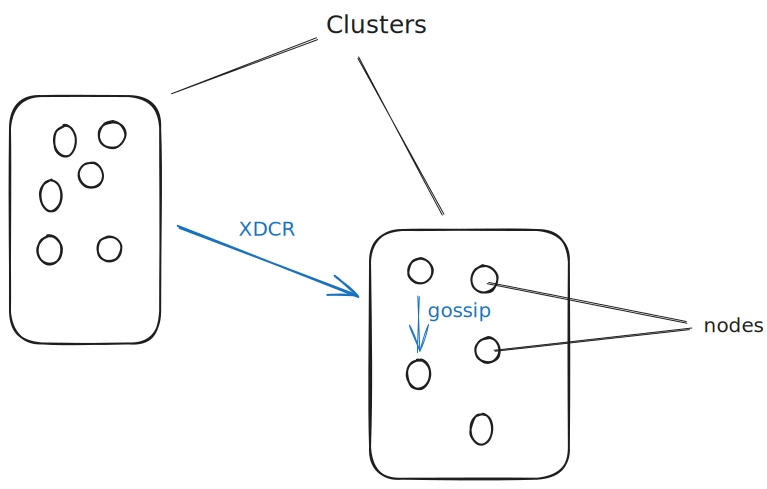
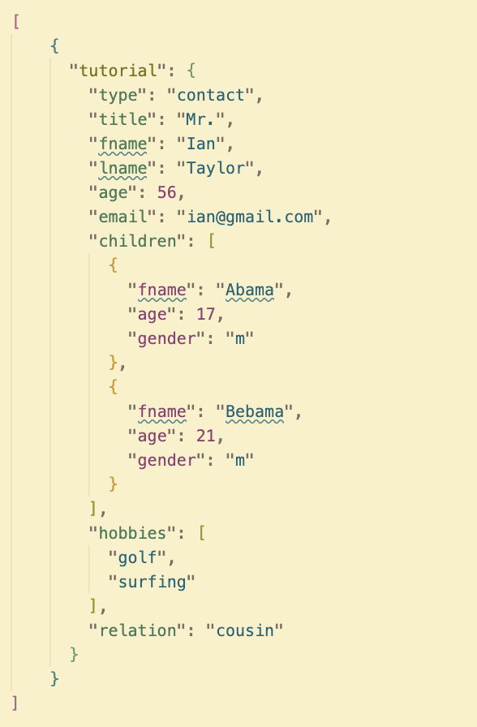
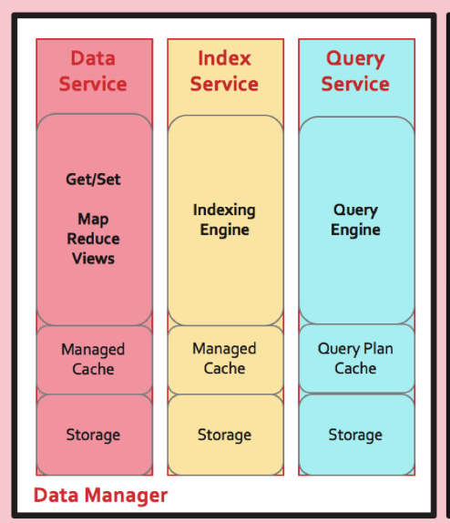
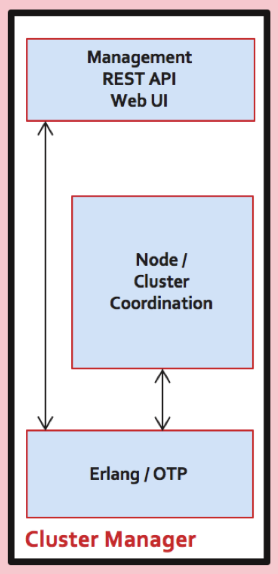

\
\
\
\

# Couchbase

---

### Overview

- Source-available
- Distributed
- NoSQL
- Multi-model
- Optimized for scalability and low latency
- Shared-nothing architecture

---

## 

---

\
\
\
\

# Design and architecture of the system

---

### Data

- Couchbase is both a key-value and a document database
- Storage in JSON documents
- CRUD operations can be performed on document

https://couchbase.live/examples/basic-sql++-documents-not-rows

---

### Storage

- Items are stored in buckets
- 1 bucket is implemented by 1024 vBuckets
- Most deployments have two or three buckets
- Replica buckets instantiated at bucket creation
- Item < vBucket < node < cluster
  

---

### Data management

Access data via _Services_:

- _Data service_
- _Index service_
- _Query service_
  https://couchbase.live/examples/basic-sql++-combine-multiple-statements
  

---

### Cluster management

- Additional nodes can be initialised and join a cluster
- Cluster management via REST API or Couchbase UI
- The cluster manager is written in Erlang
  

---

---

### Failover

- _Graceful failover_
  Replica vBuckets ensure continued data availability to the application

- _Hard failover_
- _Automatic failover_
- _Rebalance_ should occur when nodes are added to or removed from a cluster

---

### Cross Data Center Replication

- Cross Data Center Replication (XDCR) replicates data from a bucket on the source cluster, and the data is received by a bucket on the target cluster
- The source and target cluster can be different
- Replicates data across multiple data centers in different geographical locations

---

\
\
\
\

# How does this apply to CAP?

---

---

\
\
\
\

# Use cases of the database

---

## Popular companies that use Couchbase

---

## Gaming

Gaming considerations:

- Large numbers of concurrent users
- Responsiveness
- Availability 24/7
- Frequent updates
  https://couchbase.live/examples/basic-sql++-generating-scoreboards

---

## Use case: Jam City

_Jam City_ is a Facebook game which began to use Couchbase due to anticipated increased scalability requirement

---

## Failover and rebalance

Live traffic is not functionally affected when nodes are manually updated or maintained:

- Graceful failover of the target node performed (replica vBuckets activated)
- Maintenance operations performed on the target node
- Target node added back to cluster and rebalance occurs
- Cluster is at original state with updated target node

---

### Iterative game design

- JSON data model facilitates iterative game design
- No need to request and wait for schema changes
- Database schema flexibility and increased application speed

---

## Media

Broadcasting/media considerations:

- Sign-up and sign-in platform
- Fluctuating user numbers
- Frequent content updates
- Potentially millions of users

---

## Use case: Sky

Sky is the largest TV broadcaster and media company in Europe, and has over 22 million users

Couchbase offered Sky increased scalability and performance in comparison with Oracle RDBMS

---

### Identity platform

- _Sky_ moved its identity platform from Oracle RDBMS to Couchbase
- XDCR ensures there is always a backup of data if there are issues with one data centers
- XDCR tends to operate at the speed of network and/or memory with low latency
- 50% reduction in sign-in response time due to XDCR

---

### Disaster recovery

- Setup - Unidirectional XDCR from the primary cluster to a disaster recovery cluster
- The Disaster Recovery cluster is promoted to be the Primary cluster, and the old Primary cluster is demoted the new Disaster Recovery cluster
- Reduced recovery time from hours to minutes

---

\
\
\
\

# Pros / Cons

---

_"There are many key factors that made us choose Couchbase: scalability, high availability, XDCR, flexible schema, and advanced monitoring, to name a few."_

_Krishnan Venkatasubramanian
Head of IT Architecture, Sky_

---

\
\
\
\

# Demo

https://couchbase.live/examples/basic-sql++-basics

---

### Reading

Couchbase playground
https://couchbase.live/

Glossary
https://docs.couchbase.com/server/current/learn/glossary.html

Intra-cluster-replication
https://docs.couchbase.com/server/current/learn/clusters-and-availability/intra-cluster-replication.html

Intro / marketing video:
https://www.youtube.com/watch?v=7OKSgtDt1lo
