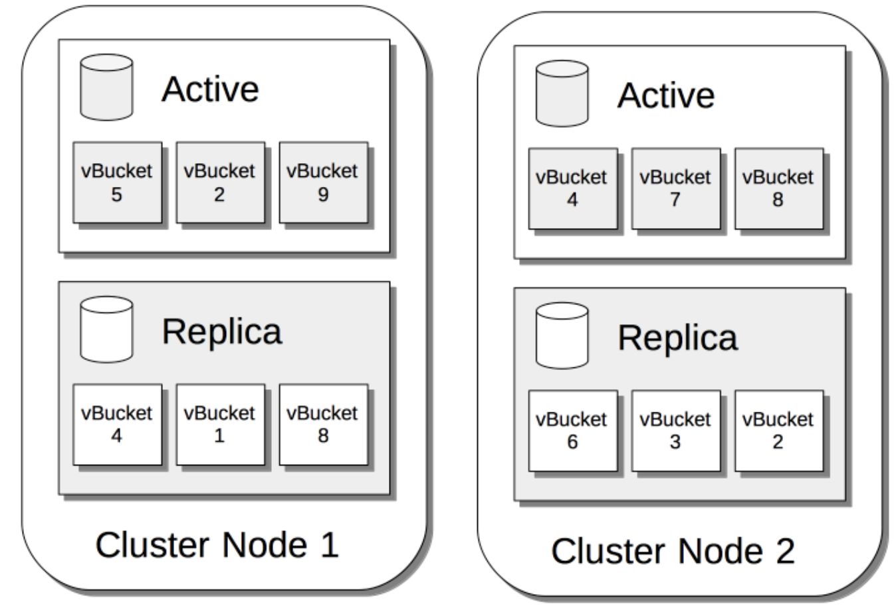
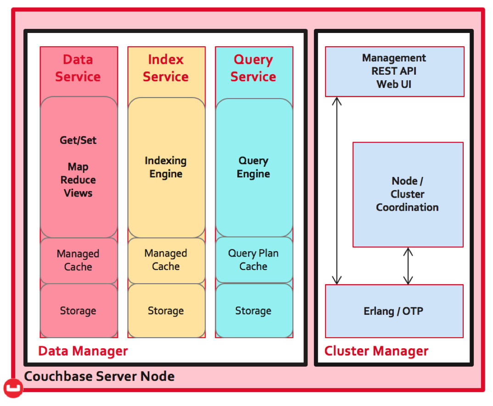

\
\
\
\

# Overview

---

### Overview

- source-available
- distributed
- shared-nothing architecture
- multi-model
- NoSQL
- SQL++ for querying

---

# Design and architecture of the system

---

### Data

- Data is stored as items in document
- Each item has a key and a value, and is identified by a unique Document ID
- Keys and values are stored as JSON documents
- CREATE, RETRIEVE, UPDATE AND DELETE (CRUD) operations can be performed on document

---

### Storage

- Items are stored in buckets, which are named data containers
- Most deployments have two or three buckets and generally no more than five
- At bucket creation, replica buckets are configured via intra-cluster replication
  

---

### Data management

- Couchbase Server provides multiple ways of accessing data via _Services_
  Key services:
- _Data service_ is used to store and retrieve data-items by key
- _Index service_ is used to create indices
- _Query service_ is used to retrieve data-items via queries, and uses the Data and Index services

---

### Cluster management

- A cluster is one or more nodes which are each running a Couchbase Server
- Additional nodes can be initialised and join a cluster
- REST API underpins the UI?
- The cluster manager is written in Erlang, a virtual machine based language

<!-- May draw one -->

---

### Failover

_Failover_ is when a node is removed from a cluster with speed.

- When a data service node is removed manually it is known as a _graceful failover_.
- It occurs on a data-service node that needs to be operated on and triggers replica vBuckets on the remaining nodes to become active.
- This ensures continued data availability to the application

- When a node fails it is known as a _hard failover_. _Automatic failover_ is hard failover initiated by the server

---

### Rebalance

- _Rebalance_ is when data is redistributed between the available nodes in the cluster
- It should occur when nodes are added to or removed from a cluster

---

### Cross Data Center Replication

- Cross Data Center Replication (XDCR) replicates data from a bucket on the source cluster, and the data is received by a bucket on the target cluster

- The source and target cluster can be different, unlike in intra-cluster replication
- XDCR replicates data across multiple data centers in different geographical locations so data is close to users

---

\
\
\
\

# How does this apply to CAP?

---

---

\
\
\
\

# Use cases of the database

---

## Popular companies that use Couchbase

---

## Gaming

Gaming considerations:

- Large numbers of concurrent users (often global)
- Responsiveness
- Availability 24/7
- Frequent updates
- Semi and unstructured data?

In gaming, databases are used to store data such as character data, saved games, scores and much more

---

## Use case: Jam City

_Jam City_ is a Facebook game which began to use Couchbase due to anticipated increased scalability requirement

---

## Failover and rebalance

The failover and rebalance means that live traffic is not functionally affected when nodes are manually updated or maintained:

- Graceful failover of the target node performed (replica vBuckets activated)
- Maintenance operations performed on the target node
- Target node added back to cluster and rebalance occurs
- Cluster is at original state with updated target node

---

### Iterative game design

- Game design is based on continuous iteration
- The JSON data model allows the game to iterate without having to request and wait for schema changes (altering of database structure)
- The JSON data model of Couchbase benefits Jam City by providing database schema flexibility and increased application speed
<!-- - Iterative game design includes planning, design, coding, testing, release and evaluation -->

---

## Media

Broadcasting/media considerations:

- Sign-up and sign-in platform
- Fluctuating user numbers - i.e. tea-time peak and peak during the Coronation
- Frequent content updates
- Potentially millions of users (depending on the company)

---

## Use case: Sky

Sky is the largest TV broadcaster and media company in Europe, and has over 22 million users

Couchbase offered Sky increased scalability and performance in comparison with Oracle RDBMS, which is particularly important during viewing peaks

---

### Identity platform

- _Sky_ moved its identity platform - which enables user sign-up and sign in - from Oracle RDBMS to Couchbase
- XDCR ensures there is always a backup of data if there are issues with one data centers, ensuring data availabilty and resilience
- XDCR tends to operate at the speed of network and/or memory with low latency
- Moving the platform provided Sky with a 50% reduction in sign-in response time due to XDCR

---

### Disaster recovery

- Disaster recovery is setup with unidirectional XDCR from the primary cluster to a disaster recovery cluster
- In disaster recovery, the Disaster Recovery cluster is promoted to be the Primary cluster, and the old Primary cluster is demoted the new Disaster Recovery cluster
- Moving to Couchbase reduced recovery time from hours to minutes

---

\
\
\
_"There are many key factors that made us choose Couchbase: scalability, high availability, XDCR, flexible schema, and advanced monitoring, to name a few."_

_Krishnan Venkatasubramanian
Head of IT Architecture, Sky_

---

\
\
\
\

# Pros / Cons

---

\
\
\
\

# Demo

---

### Reading

https://couchbase.live/ (online sandbox)

glossary
https://docs.couchbase.com/server/current/learn/glossary.html

intra-cluster-replication
https://docs.couchbase.com/server/current/learn/clusters-and-availability/intra-cluster-replication.html

intro / marketing video:
https://www.youtube.com/watch?v=7OKSgtDt1lo
